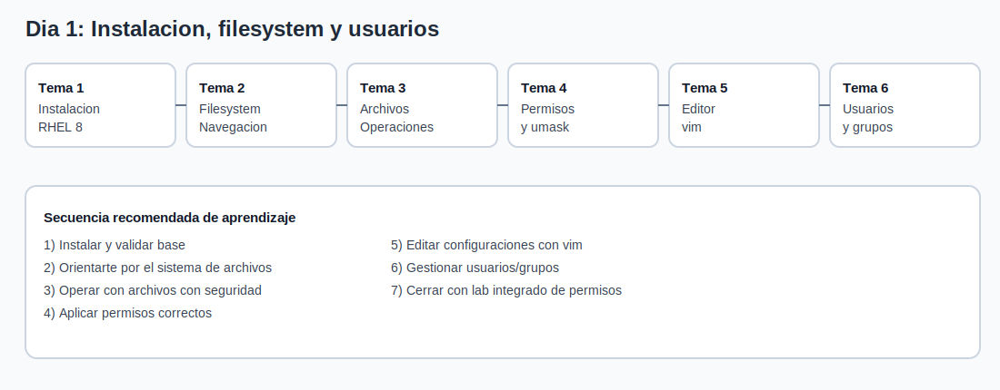

# Dia 1 - Instalacion, sistema de archivos y usuarios

## Indice del Dia 1 (material asociado)

- [`tema1-instalacion-rhel8.md`](tema1-instalacion-rhel8.md) -> instalacion RHEL 8 en modo grafico/texto, primer arranque y entorno de escritorio.
- [`tema2-sistema-archivos-navegacion.md`](tema2-sistema-archivos-navegacion.md) -> estructura del filesystem y navegacion (`cd`, `ls`, `pwd`).
- [`tema3-operaciones-archivos.md`](tema3-operaciones-archivos.md) -> operaciones con archivos (`touch`, `cp`, `mv`, `rm`).
- [`tema4-permisos-propietarios-umask.md`](tema4-permisos-propietarios-umask.md) -> `chmod`, `chown`, `umask` (numerico y simbolico).
- [`tema5-editor-vim.md`](tema5-editor-vim.md) -> fundamentos de `vim` para operacion diaria.
- [`tema6-usuarios-grupos.md`](tema6-usuarios-grupos.md) -> usuarios/grupos y ficheros clave (`/etc/passwd`, `/etc/shadow`, `/etc/group`).
- [`comandos-dia1.md`](comandos-dia1.md) -> chuleta de comandos del dia 1.
- [`labs-dia1.md`](labs-dia1.md) -> laboratorio principal: instalacion minima + usuarios + politicas de permisos.

---

## Resumen ejecutivo del dia

1. Dejar una VM funcional desde cero (instalacion y checks iniciales).
1. Entender el mapa minimo del sistema de archivos para orientarte sin perder tiempo.
1. Manejar operaciones diarias de ficheros con criterio seguro.
1. Diagnosticar incidencias de permisos interpretando bien `rwx`, octal y `umask`.
1. Administrar usuarios/grupos y validar identidad efectiva.

---

## Objetivos del alumno

- Completar una instalacion base RHEL/Rocky lista para lab.
- Moverse con fluidez por directorios clave del sistema.
- Aplicar permisos y propietarios correctamente en escenarios reales.
- Editar configuraciones simples con `vim`.
- Crear usuarios/grupos y validar acceso en directorio compartido.
