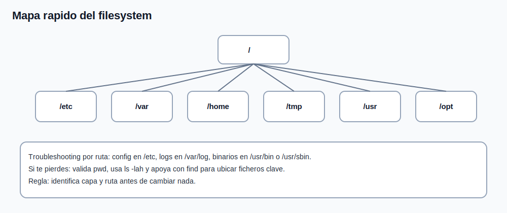

# Tema 2: Estructura del sistema de archivos y navegacion

## Objetivo

Comprender la jerarquia basica de Linux y moverse con rapidez por el sistema.



## Mapa minimo del filesystem (FHS)

1. `/` -> raiz del sistema.
1. `/etc` -> configuracion.
1. `/var` -> datos variables (logs, colas, cache).
1. `/home` -> datos de usuarios.
1. `/tmp` -> temporales.
1. `/usr` -> binarios y librerias de usuario/sistema.
1. `/opt` -> software adicional de terceros.

## Comandos base de navegacion

```bash
pwd
ls
ls -l
ls -lah
cd /etc
cd ~
cd -
cd ..
```

## Enfoque de troubleshooting

Cuando un servicio falla, orientate por rutas:

1. configuracion en `/etc`;
1. logs en `/var/log`;
1. binarios en `/usr/bin` o `/usr/sbin`;
1. datos de aplicacion en `/var/lib` o ruta especifica del servicio.

## Comandos utiles para orientacion rapida

```bash
find /etc -maxdepth 2 -name "*.conf" 2>/dev/null | head
which systemctl
type ls
du -sh * 2>/dev/null | sort -h
```

## Errores frecuentes

1. ejecutar comandos destructivos en ruta equivocada por no validar `pwd`;
1. confundir archivos de configuracion con datos de ejecucion;
1. perder tiempo buscando logs en rutas incorrectas.
