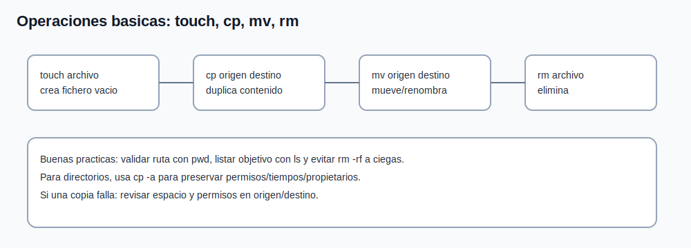

# Tema 3: Operaciones con archivos (`touch`, `cp`, `mv`, `rm`)

## Objetivo

Dominar operaciones basicas de ficheros/directorios con foco en seguridad operativa.



## Crear, copiar, mover y borrar

```bash
touch archivo.txt
cp archivo.txt copia.txt
mv copia.txt renombrado.txt
rm renombrado.txt
```

Para directorios:

```bash
mkdir -p dir1/subdir
cp -a dir1 dir2
mv dir2 dir3
rm -r dir3
```

## Buenas practicas

1. listar antes de borrar (`ls`) para validar objetivo;
1. preferir rutas absolutas en tareas criticas;
1. evitar `rm -rf` sin confirmacion visual del path;
1. usar `cp -a` para preservar atributos.

## Diferencia clave: mover vs copiar

1. `mv` dentro del mismo filesystem suele ser renombrado rapido.
1. `mv` entre filesystems implica copia + borrado.
1. `cp` siempre duplica contenido.

## Casos de troubleshooting

1. "archivo desaparecio":
1. revisar historial de comandos;
1. buscar por nombre y fecha (`find`, `ls -lt`).
1. "copia incompleta":
1. validar espacio en disco (`df -h`);
1. revisar permisos en origen y destino.
