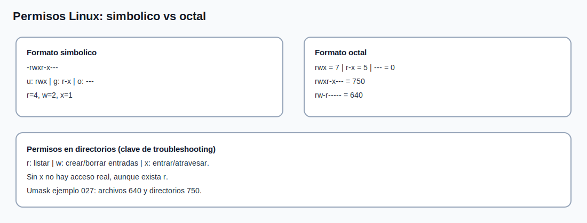

# Tema 4: Permisos y propietarios (`chmod`, `chown`, `umask`)

## Objetivo

Entender y aplicar permisos Linux correctamente, tanto en formato numerico (octal) como simbolico (letras), para resolver incidencias de acceso.



## Modelo de permisos

Se evalua en tres bloques:

1. `u` (user): propietario.
1. `g` (group): grupo propietario.
1. `o` (others): resto de usuarios.

Cada bloque puede tener:

1. `r` (read) = 4
1. `w` (write) = 2
1. `x` (execute) = 1

## Formato simbolico (letras)

Ejemplo:

```text
-rwxr-x---
```

Interpretacion:

1. `-` -> archivo regular (`d` seria directorio).
1. `rwx` -> propietario: lee, escribe, ejecuta.
1. `r-x` -> grupo: lee y ejecuta.
1. `---` -> otros: sin permisos.

## Formato numerico (octal)

Se suma por bloque (`r=4`, `w=2`, `x=1`):

1. `rwx` = 7 (4+2+1)
1. `rw-` = 6 (4+2)
1. `r-x` = 5 (4+1)
1. `r--` = 4
1. `---` = 0

Entonces:

```text
rwxr-x---  -> 750
rw-r-----  -> 640
rwxrwx---  -> 770
```

## `chmod`: numerico y simbolico

Numerico:

```bash
chmod 640 informe.txt
chmod 750 script.sh
chmod 770 /srv/proyecto
```

Simbolico:

```bash
chmod u+x script.sh
chmod g-w archivo.txt
chmod o-rwx secreto.txt
chmod ug+rw compartido.txt
```

## `chown` y `chgrp`

Cambiar propietario y grupo:

```bash
chown ana:dev informe.txt
chown -R ana:dev /srv/proyecto
chgrp dev informe.txt
```

## `umask`: permisos por defecto

`umask` resta permisos al crear archivos/directorios.

Valores base tipicos:

1. archivo nuevo: `666`
1. directorio nuevo: `777`

Ejemplo con `umask 027`:

1. archivos: `666 - 027 = 640`
1. directorios: `777 - 027 = 750`

Comandos:

```bash
umask
umask 027
```

## Diferencia clave archivo vs directorio

En directorios:

1. `r` -> listar contenido;
1. `w` -> crear/borrar nombres dentro;
1. `x` -> entrar/atravesar el directorio.

Sin `x`, aunque tengas `r`, no puedes acceder correctamente al contenido.

## Diagnostico rapido de "Permission denied"

```bash
whoami
id
namei -l /ruta/objetivo
ls -ld /ruta/objetivo
getfacl /ruta/objetivo 2>/dev/null || true
```

## Caso practico corto

Objetivo: solo `ana` y grupo `dev` pueden trabajar en `/srv/proyecto`.

```bash
mkdir -p /srv/proyecto
chown root:dev /srv/proyecto
chmod 2770 /srv/proyecto
```

`2770`:

1. `2` -> setgid en directorio (hereda grupo `dev`).
1. `770` -> acceso completo para owner y grupo, nada para otros.
