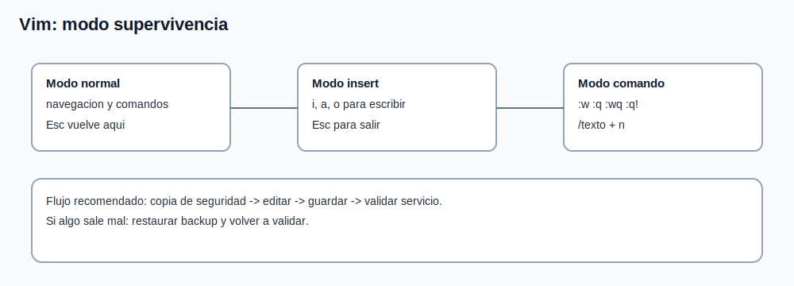

# Tema 5: Editores - `vim` (modo supervivencia)

## Objetivo

Editar ficheros de configuracion de forma segura y eficiente en servidor.



## Modos de vim

1. Normal: navegar y ejecutar comandos.
1. Insert: escribir texto (`i`, `a`, `o`).
1. Command-line: acciones con `:` (guardar, salir, buscar, etc.).

## Flujo minimo recomendado

```bash
vim /etc/hosts
```

Comandos esenciales:

1. `i` -> insertar.
1. `Esc` -> volver a modo normal.
1. `:w` -> guardar.
1. `:q` -> salir.
1. `:wq` -> guardar y salir.
1. `:q!` -> salir sin guardar.
1. `/texto` -> buscar.
1. `n` -> siguiente coincidencia.

## Buenas practicas al editar configuracion

1. hacer copia antes de cambios criticos:

```bash
cp /etc/archivo.conf /etc/archivo.conf.bak
```

2. editar, guardar y validar sintaxis/servicio;
3. si falla, revertir desde backup.

## Errores frecuentes

1. olvidar `Esc` y "romper" comandos;
1. salir sin guardar cambios necesarios;
1. editar archivo incorrecto por ruta confusa.
