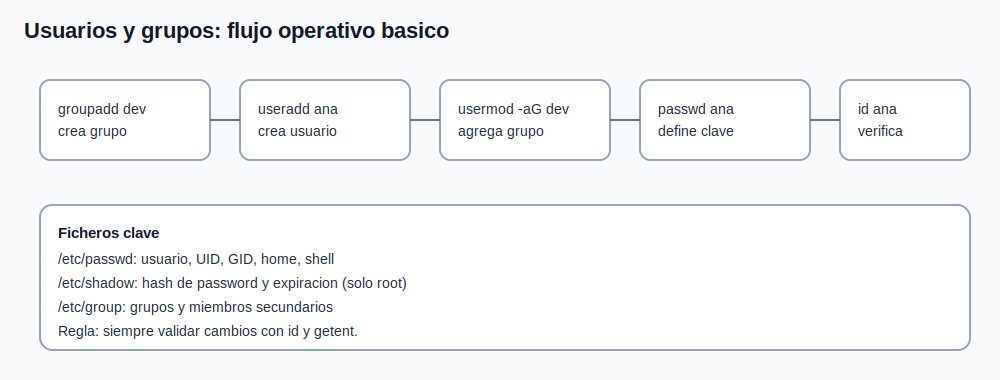

# Tema 6: Gestion de usuarios y grupos

## Objetivo

Crear y administrar usuarios/grupos con criterio operativo, entendiendo ficheros de identidad clave del sistema.



## Conceptos base

1. Usuario: identidad de ejecucion de procesos.
1. Grupo primario: grupo principal del usuario.
1. Grupos secundarios: permisos adicionales por pertenencia.
1. UID/GID: identificadores numericos reales que usa el sistema.

## Comandos principales

```bash
groupadd dev
useradd ana
passwd ana
usermod -aG dev ana
id ana
groups ana
getent passwd ana
getent group dev
```

## Ficheros clave

1. `/etc/passwd`:
1. datos basicos de cuenta (usuario, UID, GID, home, shell).
1. `/etc/shadow`:
1. hash de contrasena y politicas de expiracion (solo root).
1. `/etc/group`:
1. grupos y miembros secundarios.

Consulta rapida:

```bash
grep '^ana:' /etc/passwd
sudo grep '^ana:' /etc/shadow
grep '^dev:' /etc/group
```

## Buenas practicas

1. no editar manualmente `/etc/shadow`;
1. usar `usermod -aG` (sin `-a` puedes perder grupos existentes);
1. validar siempre con `id` y `getent` tras cambios;
1. definir shell y home de forma explicita en cuentas operativas.

## Politicas basicas de cuentas (intro)

```bash
chage -l ana
passwd -S ana
```

Con esto puedes revisar expiracion y estado de password.

## Caso practico corto

Objetivo: dos usuarios (`ana`, `bruno`) comparten trabajo en grupo `dev`.

```bash
groupadd dev
useradd ana
useradd bruno
usermod -aG dev ana
usermod -aG dev bruno
id ana
id bruno
```

Si un usuario no accede a carpeta de grupo:

1. revisar pertenencia efectiva (`id`);
1. revisar propietario/grupo del directorio (`ls -ld`);
1. revisar permisos (`rwx`) y setgid si aplica.
