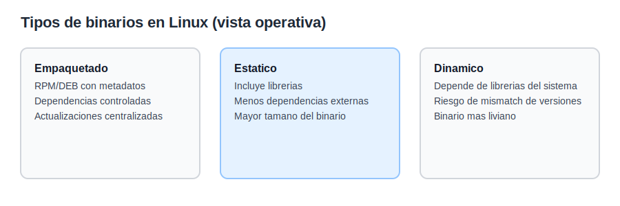
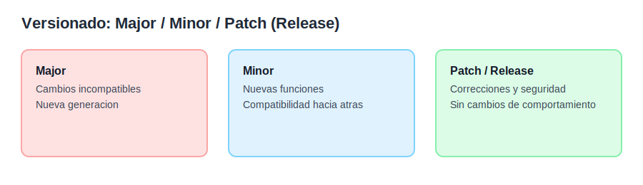
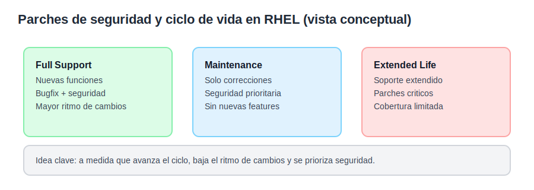

# Tema 1: Gestion de software con dnf/yum y repositorios

## Objetivo
Dar una base teorica clara para diagnosticar problemas de software y actualizaciones en Linux, con foco en RHEL/Rocky y una nota de equivalencias en macOS.

## Teoria general de Linux
Un gestor de paquetes resuelve tres problemas: instala software, mantiene dependencias y permite actualizaciones controladas. En diagnostico, muchos fallos vienen de dependencias rotas, repositorios incorrectos o versiones incompatibles. Por eso hay que pensar en: fuente del paquete, version instalada y estado de las dependencias.

Conceptos clave:
1. Paquete: unidad de software instalable con metadatos de version y dependencias.
1. Dependencia: relacion entre paquetes que requiere una version minima.
1. Repositorio: fuente de paquetes firmados y con metadatos.
1. Versionado: semantica que permite saber si una actualizacion es compatible.
1. Transaccion: conjunto de operaciones de instalacion o borrado que deben completar o fallar juntas.

## Tipos de binarios y distribucion
En Linux, "binario" suele referirse a ejecutables compilados. A nivel practico, hay tres formas comunes de distribuir software:
1. Binarios empaquetados: vienen en paquetes (RPM/DEB) con metadatos y dependencias.
1. Binarios estaticos: incluyen librerias dentro del ejecutable y no dependen del sistema.
1. Binarios dinamicos: dependen de librerias del sistema y pueden fallar si faltan o no coinciden versiones.

En entornos corporativos, se priorizan binarios empaquetados por control, trazabilidad y actualizaciones.



## Versionado: release, minor y major
El versionado separa cambios por impacto:
1. Major: cambios grandes o incompatibles con versiones anteriores.
1. Minor: nuevas funciones compatibles hacia atras.
1. Patch o release: correcciones de errores o seguridad sin cambiar comportamiento.

En RHEL, el esquema es X.Y (por ejemplo 8.9 o 9.4). El numero mayor (X) define la generacion. El menor (Y) es la version de soporte. En troubleshooting, un salto major es un cambio de plataforma; un salto minor es cambio controlado y compatible.



## Parches de seguridad y ciclo de vida (RHEL)
En RHEL, las actualizaciones de seguridad se mantienen durante el ciclo de vida, pero el ritmo y el tipo de cambios varian segun la fase. En Full Support hay mas cambios y mejoras. En Maintenance se priorizan correcciones y seguridad. En Extended Life la cobertura es limitada y suele centrarse en parches criticos.



Riesgos tipicos:
1. Repositorios duplicados o inestables.
1. Conflictos de version por mezclar repositorios.
1. Paquetes instalados desde fuentes externas sin control.

## Enfoque Red Hat (RHEL/Rocky)
En RHEL 9, `yum` es un wrapper de `dnf`. Se mantiene por compatibilidad, pero ambos usan el mismo backend. La teoria operativa: repositorios habilitados, repos con prioridad y metadatos coherentes.

Tipos de actualizacion:
1. Seguridad: corrige vulnerabilidades.
1. Bugfix: corrige errores sin cambiar funcionalidades.
1. Mejora: agrega funcionalidad o cambia comportamiento.

Suscripcion y repositorios:
1. La suscripcion habilita repos oficiales.
1. Sin repos oficiales, no hay updates o soporte.
1. En Rocky/Alma, los repos son clones compatibles, no oficiales.

Diagnostico rapido:
1. Ver repos habilitados y su origen.
1. Ver version instalada y version disponible.
1. Revisar historial de transacciones.

## Notas para macOS
macOS no tiene gestor de paquetes oficial para software de terceros. La opcion de facto es Homebrew. El concepto es el mismo: repos, metadatos y dependencias. Diferencia clave: hay mas variabilidad y menos control centralizado.

## Ejemplos basicos (RHEL/Rocky)
```bash
# Ver repositorios habilitados
dnf repolist

# Buscar un paquete
dnf search nginx

# Ver informacion y versiones disponibles
dnf info nginx

# Instalar o actualizar
dnf install nginx
dnf update nginx

# Ver historial de transacciones
dnf history
```

## Ejemplo basico (macOS)
```bash
# Buscar e instalar con Homebrew
brew search nginx
brew install nginx
brew info nginx
```
