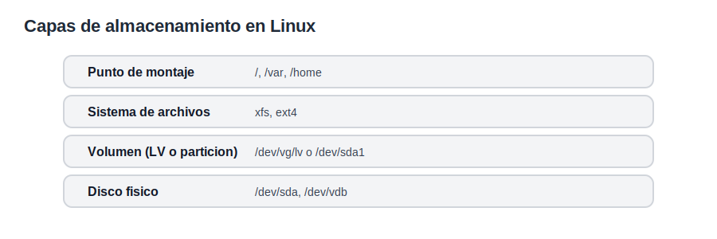
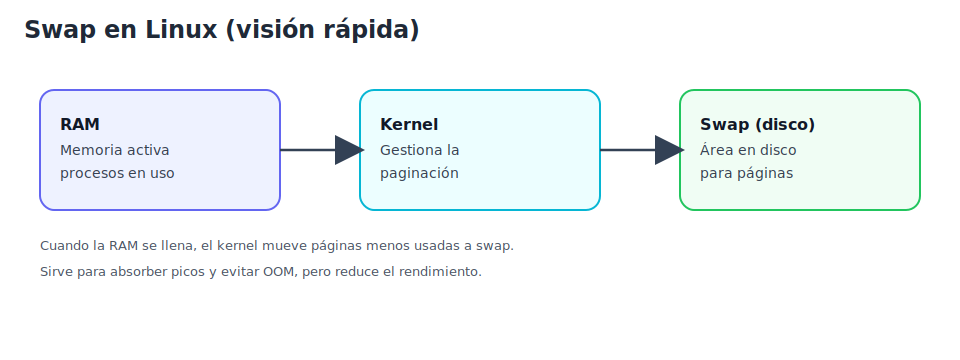
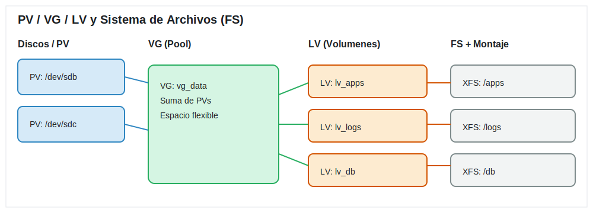
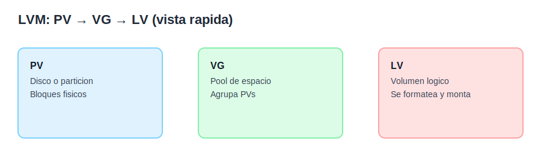
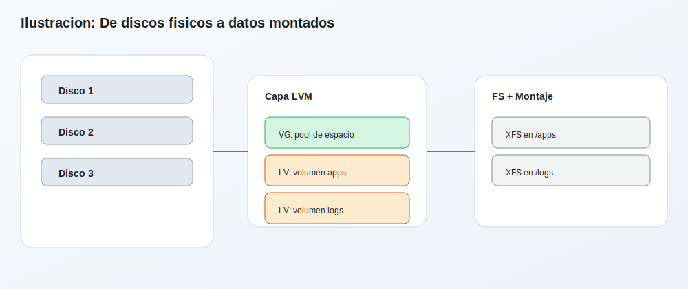
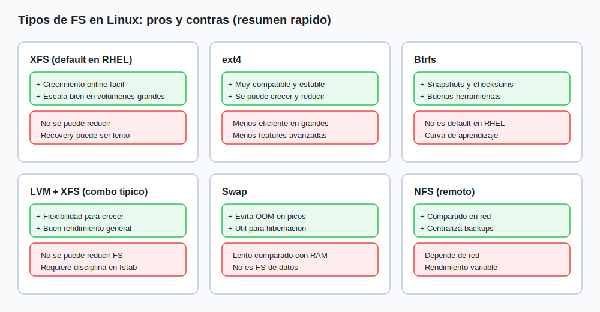

# Tema 2: Discos y almacenamiento, particionado basico y LVM basico

## Objetivo
Entender la estructura del almacenamiento en Linux para diagnosticar fallos de disco, particiones, montajes y capacidad.

## Teoria general de Linux
El almacenamiento se organiza en capas. Discos fisicos, particiones, sistemas de archivos y puntos de montaje. Cada capa puede fallar o estar mal configurada.

Conceptos clave:
1. Disco: dispositivo fisico o virtual.
1. Particion: subdivision del disco.
1. Sistema de archivos: estructura que guarda datos.
1. Punto de montaje: ruta donde se accede al sistema de archivos.
1. Persistencia: configuracion de montaje en el arranque.

El archivo `/etc/fstab` define montajes persistentes. Un error en `fstab` puede impedir el arranque o dejar el sistema en modo de emergencia.



### 2.1 Swap (memoria de paginacion)
Swap es un area de disco que el kernel usa como extension de la RAM. En Linux es clave para absorber picos de memoria, evitar OOM (out of memory) en cargas puntuales y, si aplica, permitir hibernacion.



Puntos operativos:
1. Cuando falta RAM, el kernel puede paginar a swap; esto evita caidas, pero ralentiza el sistema.
1. Swap no reemplaza RAM: es un mecanismo de contencion, no de rendimiento.
1. En troubleshooting, revisar swap ayuda a detectar presion de memoria.
1. Se puede usar como particion dedicada o como archivo (swapfile).
1. Debe estar dimensionada y monitorizada (uso sostenido suele indicar falta de RAM o leak).

Comandos rapidos:
1. `free -h` para ver RAM y swap.
1. `swapon --show` o `cat /proc/swaps` para listar swap activa.
1. `vmstat 1 5` para observar presion de memoria.

## Enfoque Red Hat (RHEL/Rocky)
En instalaciones modernas de RHEL, LVM es el estandar porque permite flexibilidad. LVM introduce capas logicas que permiten crecer o reducir volumenes sin tocar el disco fisico de forma directa.

Modelo LVM:
1. PV: Physical Volume.
1. VG: Volume Group.
1. LV: Logical Volume.



Ventajas:
1. Expandir capacidad sin downtime largo.
1. Organizar volumenes por uso.
1. Mejor control en entornos virtualizados.







Herramientas tipicas:
1. `lsblk` para ver topologia.
1. `pvs`, `vgs`, `lvs` para ver LVM.
1. `lvextend` y `xfs_growfs` para crecer volumenes XFS.

## Historia de LVM (version corta y util)
LVM nacio para resolver un problema clasico: los discos se quedaban sin espacio en la particion adecuada y mover datos era doloroso. El enfoque tradicional con particiones fijas obligaba a planificar todo desde el dia 1 y cualquier cambio implicaba downtime y riesgos.

Linea de tiempo simplificada:
1. 1990s: aparecen las primeras implementaciones de volumenes logicos en UNIX comerciales. La idea era separar el almacenamiento fisico del logico.
1. Principios de 2000s: llega LVM1 a Linux, con limitaciones en escalado y flexibilidad.
1. Mediados de 2000s: LVM2 reemplaza a LVM1 e integra `device-mapper`, que es el motor del kernel para mapear bloques.
1. Desde entonces: LVM2 se vuelve el estandar en RHEL y derivados. Es estable, soporta snapshots, mirroring, thin provisioning y se integra con herramientas de instalacion.

Lo importante para un junior: hoy en dia hablamos de LVM2, no LVM1. Cuando veas comandos `lvm`, `pvcreate`, `vgcreate`, `lvcreate`, estas usando LVM2 y `device-mapper` por debajo.

## LVM hoy: como se configura en RHEL/Rocky
En RHEL/Rocky modernos, LVM suele configurarse durante la instalacion, pero es comun hacerlo a mano en servidores y laboratorios. El flujo es casi siempre el mismo.

### Flujo estandar (disco nuevo para datos)
1. Detectar disco nuevo con `lsblk`.
1. Crear PV con `pvcreate`.
1. Crear VG con `vgcreate`.
1. Crear LV con `lvcreate`.
1. Formatear con `mkfs.xfs` o `mkfs.ext4`.
1. Montar y persistir en `/etc/fstab`.

### Flujo con particion (si necesitas GPT/MBR)
Algunas politicas piden particionar antes. En ese caso:
1. Crear particion tipo LVM con `fdisk` o `parted`.
1. Usar esa particion como PV, por ejemplo `/dev/sdb1`.
1. El resto del flujo es igual.

### Por que se usa XFS en RHEL
RHEL usa XFS por defecto porque escala bien con volumenes grandes y soporta crecimiento online. Importante: XFS no se puede reducir. Si necesitas reducir, planifica con ext4 o recrea el volumen.

### Comandos clave que un junior debe memorizar
1. Ver topologia: `lsblk -f`, `blkid`.
1. Ver LVM: `pvs`, `vgs`, `lvs`, `lvdisplay`, `vgdisplay`.
1. Crear: `pvcreate`, `vgcreate`, `lvcreate`.
1. Crecer: `lvextend` y luego `xfs_growfs` o `resize2fs`.
1. Montajes: `mount`, `umount`, revisar `/etc/fstab`.

## Buenas practicas actuales
1. Nombres claros: `vg_data`, `lv_apps`, `lv_logs`.
1. No usar `echo >> /etc/fstab` en produccion. Editar con cuidado o usar `UUID=`.
1. Usar `UUID` o `LABEL` en `/etc/fstab` para evitar cambios de nombre de dispositivo.
1. Documentar tamanos y proposito de cada LV.
1. Antes de crecer, verificar espacio libre del VG con `vgs`.
1. En XFS, siempre crecer con `xfs_growfs` despues de extender el LV.

## Ejemplo completo actualizado (RHEL/Rocky)
```bash
# 1) Ver discos
lsblk -f

# 2) Crear PV (disco completo)
pvcreate /dev/sdb

# 3) Crear VG
vgcreate vg_data /dev/sdb

# 4) Crear LV de 10G
lvcreate -L 10G -n lv_apps vg_data

# 5) Formatear (XFS recomendado en RHEL)
mkfs.xfs /dev/vg_data/lv_apps

# 6) Crear punto de montaje y montar
mkdir -p /apps
mount /dev/vg_data/lv_apps /apps

# 7) Hacer persistente con UUID
blkid /dev/vg_data/lv_apps
# Copiar el UUID y agregar en /etc/fstab, por ejemplo:
# UUID=xxxx-xxxx /apps xfs defaults 0 0
```

## Crecer un LV en produccion (pasos seguros)
```bash
# 1) Ver espacio libre
vgs

# 2) Extender LV en 5G
lvextend -L +5G /dev/vg_data/lv_apps

# 3) Crecer el filesystem
xfs_growfs /apps
```

## Errores comunes de junior
1. Olvidar crecer el filesystem despues de `lvextend`.
1. Editar mal `/etc/fstab` y dejar el sistema en emergency mode.
1. Usar el dispositivo equivocado y crear un PV en el disco del sistema.
1. Creer que XFS se puede reducir.

## Notas para macOS
macOS usa APFS con contenedores y volumenes. Conceptualmente se parece a LVM, pero con herramientas distintas. Para diagnostico basico se usa `diskutil` y el enfoque es revisar discos, contenedores y volumenes APFS.

## Ejemplos basicos (RHEL/Rocky)
```bash
# Ver discos y particiones
lsblk -f

# Ver LVM
pvs
vgs
lvs

# Crear un PV y un VG
pvcreate /dev/sdb
vgcreate vg_data /dev/sdb

# Crear un LV, formatear y montar
lvcreate -L 5G -n lv_apps vg_data
mkfs.xfs /dev/vg_data/lv_apps
mkdir -p /apps
mount /dev/vg_data/lv_apps /apps

# Hacer montaje persistente
echo "/dev/vg_data/lv_apps /apps xfs defaults 0 0" >> /etc/fstab
```

## Ejemplo basico (macOS)
```bash
# Ver discos y volumenes
diskutil list

# Informacion de un volumen
diskutil info /dev/disk1
```
