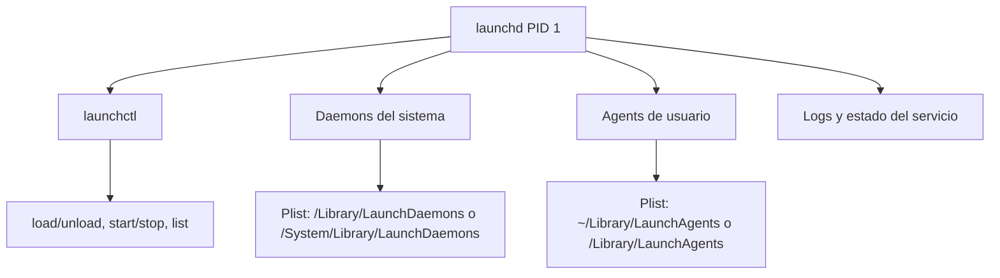

# Tema 3: Servicios con systemctl (systemd)

## Objetivo
Comprender el modelo de servicios en Linux, su ciclo de vida y como diagnosticar fallos de servicios con systemd.

## Teoria general de Linux
Un servicio es un proceso que se ejecuta en segundo plano y ofrece una funcion continua. El sistema de init se encarga de arrancar servicios y mantener su estado. En Linux moderno, el init mas comun es systemd.

Conceptos clave:
1. Unidad: archivo que define un servicio o recurso.
1. Estado: activo, inactivo, fallido.
1. Arranque: habilitado o deshabilitado al iniciar el sistema.
1. Dependencias: orden de arranque y relacion entre servicios.
1. Logs: fuente principal para diagnostico.

Errores tipicos:
1. Servicio habilitado pero fallando al iniciar.
1. Dependencia no disponible.
1. Configuracion incorrecta o permisos.


## Historia y por que es importante
Antes de systemd, muchas distros usaban sysvinit o upstart. El arranque era mas lento, con scripts mas fragiles y menos visibilidad. systemd centraliza el arranque, el monitoreo y los logs, y por eso hoy es el estandar en RHEL, Rocky y la mayoria de Linux empresariales.

Lo importante para un junior:
1. systemd no solo maneja servicios, tambien timers, mounts, sockets y targets.
1. Un servicio puede estar habilitado pero no activo, o activo pero no habilitado.
1. El diagnostico casi siempre se resuelve con `systemctl status` y `journalctl -u`.

## Tipos de unidades (units) mas comunes
1. `service`: proceso en background (sshd, httpd, chronyd).
1. `target`: grupo de unidades (multi-user.target, graphical.target).
1. `timer`: tareas programadas (similar a cron).
1. `socket`: arranque bajo demanda cuando hay conexion.
1. `mount`: montajes gestionados por systemd.
1. `path`: dispara acciones cuando cambia un archivo o directorio.

## Ciclo de vida y estados
Estados tipicos:
1. `active (running)`: el servicio esta activo y corriendo.
1. `inactive (dead)`: no esta corriendo.
1. `failed`: intento de inicio fallido.

Acciones tipicas:
1. `start`: inicia ahora.
1. `stop`: detiene ahora.
1. `restart`: reinicia.
1. `reload`: recarga configuracion sin reiniciar.
1. `enable`: arranca al boot.
1. `disable`: no arranca al boot.

## Donde viven los unit files
1. `/usr/lib/systemd/system/`: unidades del sistema (paquetes).
1. `/etc/systemd/system/`: overrides y unidades custom.
3. `~/.config/systemd/user/`: servicios de usuario (no root).

## Estructura basica de un service file
1. `[Unit]`: descripcion, dependencias (`After=`, `Wants=`).
1. `[Service]`: como se ejecuta (`ExecStart=`, `User=`, `Restart=`).
1. `[Install]`: en que target se habilita (`WantedBy=`).

## Enfoque Red Hat (RHEL/Rocky)
systemd es el estandar en RHEL 8. Se usa `systemctl` para controlar servicios y `journalctl` para logs.

Servicios comunes:
1. `sshd` para acceso remoto.
1. `firewalld` para firewall.
1. `NetworkManager` para red.
1. `chronyd` para tiempo.
1. `rsyslog` o `systemd-journald` para logs.
1. `crond` para tareas programadas.


## Notas para macOS
macOS usa `launchd` y `launchctl`. El concepto es similar: servicios definidos como plist, estados y logs. El enfoque equivalente es revisar servicios y reiniciarlos con `launchctl`.
macOS se basa en Darwin (núcleo XNU), que integra Mach y capas BSD; Apple indica que Darwin se basa en tecnologías FreeBSD y Mach. Origen y base técnica: [Apple Newsroom: Darwin 1.0](https://www.apple.com/newsroom/2000/04/05Apple-Releases-Darwin-1-0-Open-Source/) y [BSD Overview (Apple Dev)](https://developer.apple.com/library/archive/documentation/Darwin/Conceptual/KernelProgramming/BSD/BSD.html).

### Infografia: servicios en macOS (launchd)


## Ejemplos basicos (RHEL/Rocky)
```bash
# Estado y control basico
systemctl status sshd
systemctl start sshd
systemctl stop sshd
systemctl restart sshd

# Habilitar o deshabilitar al arranque
systemctl enable sshd
systemctl disable sshd

# Logs del servicio
journalctl -u sshd --since "today"
```

## Ejemplo: crear un servicio custom desde un script
Escenario: tienes un script propio que revisa disco y escribe un log cada minuto.

### 1) Script
```bash
sudo tee /usr/local/bin/check-disco.sh > /dev/null <<'EOF'
#!/usr/bin/env bash
date >> /var/log/check-disco.log
df -h >> /var/log/check-disco.log
echo "----" >> /var/log/check-disco.log
EOF
sudo chmod +x /usr/local/bin/check-disco.sh
```

### 2) Unit file
```bash
sudo tee /etc/systemd/system/check-disco.service > /dev/null <<'EOF'
[Unit]
Description=Chequeo rapido de disco
After=network.target

[Service]
Type=oneshot
ExecStart=/usr/local/bin/check-disco.sh

[Install]
WantedBy=multi-user.target
EOF
```

### 3) Activar y probar
```bash
sudo systemctl daemon-reload
sudo systemctl start check-disco.service
sudo systemctl status check-disco.service
```

### 4) Habilitar al arranque (si lo necesitas)
```bash
sudo systemctl enable check-disco.service
```

### 5) Ver logs
```bash
journalctl -u check-disco.service --since "today"
tail -n 20 /var/log/check-disco.log
```

Nota: si quieres que corra cada minuto, lo correcto es crear un `.timer` asociado a este service.

## Ejemplo basico (macOS)
```bash
# Listar servicios cargados
launchctl list

# Cargar o descargar un servicio
launchctl load /Library/LaunchDaemons/com.example.service.plist
launchctl unload /Library/LaunchDaemons/com.example.service.plist
```

## Gestion de servicios por GUI (RHEL/Rocky)
Para administrar servicios de forma grafica en RHEL/Rocky, la opcion recomendada es **Cockpit** (Web Console). Desde su vista de servicios puedes:
1. Ver estado (`running`, `failed`, `inactive`).
1. Iniciar, detener, reiniciar y recargar servicios.
1. Habilitar o deshabilitar servicios al arranque.
1. Revisar logs asociados.

Comando para habilitar y lanzar la interfaz de Cockpit:
```bash
sudo systemctl enable --now cockpit.socket
```

Luego abre en navegador:
```text
https://localhost:9090
```

Captura de referencia (Red Hat Web Console):

