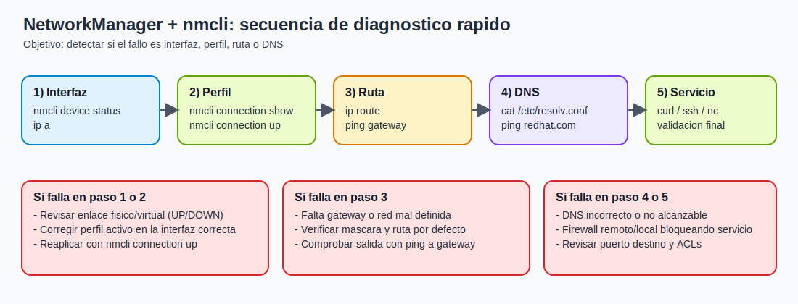
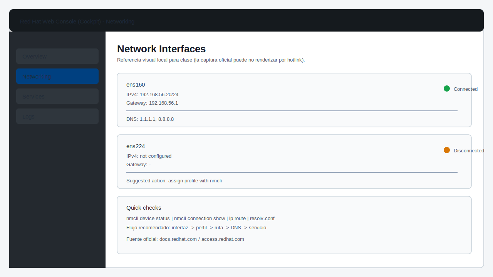

# Tema 1: Configuracion y diagnostico con NetworkManager (nmcli)

## Objetivo

Dominar una base operativa para revisar, ajustar y diagnosticar la red en RHEL/Rocky usando `NetworkManager` y `nmcli`.

## Resumen para pizarra

1. `NetworkManager` gestiona red por perfiles, no solo por interfaz.
1. El troubleshooting efectivo sigue capas: interfaz -> IP -> ruta -> DNS -> servicio.
1. `nmcli` permite cambios persistentes y repetibles (evitar cambios solo runtime con `ip`).
1. Si hay fallo, primero valida gateway; luego DNS; despues servicio objetivo.
1. Evidencia minima antes/despues: `nmcli device status`, `ip a`, `ip route`, `resolv.conf`.

## Teoria base

En sistemas Linux empresariales, la red suele gestionarse por perfiles de conexion (no solo por interfaz).  
`NetworkManager` aplica esa capa de control y `nmcli` permite operarla por terminal.

En troubleshooting, esto importa porque un problema puede estar en:

1. el dispositivo (driver, enlace, estado);
1. el perfil de conexion (IP, gateway, DNS, rutas);
1. la activacion del perfil (perfil correcto, interfaz incorrecta);
1. el entorno de salida (switch, VLAN, gateway, DNS externo).

La ventaja de `NetworkManager` es que deja trazabilidad y consistencia: cuando cambias algo con `nmcli`, queda en el perfil y puedes repetir la configuracion de forma controlada.

Conceptos clave:

1. Dispositivo: interfaz real (`ens160`, `eth0`, `wlan0`).
1. Conexion: perfil de configuracion (IP, mascara, gateway, DNS, MTU).
1. Estado: conectado, desconectado, gestionado/no gestionado.
1. Perfil activo: configuracion actualmente aplicada sobre un dispositivo.



### Captura oficial de Red Hat (referencia visual)

Vista de interfaces de red en la Web Console de RHEL (Cockpit):



Si no se visualiza en tu IDE, abre la imagen aqui:  
[Cockpit network interfaces (Red Hat)](https://access.redhat.com/webassets/avalon/d/Red_Hat_Enterprise_Linux-7-Managing_systems_using_the_RHEL_7_web_console-en-US/images/69f15abf5f7ce0f500ef8fce5df6f7a8/cockpit-network-interfaces.png)

Fuente: [Red Hat Documentation - Managing networking in the web console](https://docs.redhat.com/en/documentation/red_hat_enterprise_linux/7/html/managing_systems_using_the_rhel_7_web_console/managing-networking-in-the-web-console)

## Como piensa NetworkManager internamente (vision practica)

`NetworkManager` separa:

1. estado de dispositivos (`nmcli device`);
1. definiciones de perfil (`nmcli connection`);
1. parametros aplicados en runtime (IP, rutas, DNS activos).

Esto permite casos utiles para operaciones:

1. un mismo host puede tener varios perfiles para la misma interfaz (laboratorio, oficina, VPN);
1. puedes preconfigurar un perfil sin activarlo y aplicarlo solo cuando conviene;
1. puedes versionar cambios de red en procedimientos estandar.

Ubicacion tipica de perfiles:

1. `/etc/NetworkManager/system-connections/` (formato keyfile).

## Flujo mental de troubleshooting de red

1. Ver si la interfaz existe y esta `UP`.
1. Ver si tiene perfil activo en `NetworkManager`.
1. Comprobar direccion IP, gateway y DNS.
1. Validar conectividad por capas:
1. IP local (gateway)
1. red externa (IP publica o salto intermedio)
1. resolucion DNS (nombre)

Regla de oro: no saltar pasos.  
Si no hay conectividad al gateway, analizar DNS no aporta valor y retrasa el diagnostico.

## Diagnostico por capas (modelo operativo)

### Capa 1: enlace y estado de interfaz

Objetivo: confirmar que existe conectividad basica de enlace.

```bash
nmcli device status
ip link show
ethtool <interfaz>
```

Si la interfaz aparece `disconnected` o `DOWN`, primero resolver esto.

### Capa 2: configuracion IP local

Objetivo: validar que la IP/mascara coincide con el segmento esperado.

```bash
ip -4 a
nmcli connection show "<perfil>" | grep -E "ipv4.addresses|ipv4.method"
```

Errores tipicos:

1. mascara incorrecta;
1. IP duplicada en red;
1. metodo `manual` con parametros incompletos.

### Capa 3: enrutamiento

Objetivo: confirmar ruta por defecto y alcance de red remota.

```bash
ip route
ip route get 8.8.8.8
```

Si falta default route, el host puede hablar en LAN pero no salir a otras redes.

### Capa 4: resolucion de nombres (DNS)

Objetivo: separar fallo de conectividad IP de fallo de resolucion.

```bash
cat /etc/resolv.conf
getent hosts redhat.com
```

Si IP funciona y DNS falla, ajustar `ipv4.dns` y revisar servidor DNS corporativo.

## Logs utiles para diagnostico

```bash
journalctl -u NetworkManager --since "30 min ago"
nmcli general logging
```

Con estos logs puedes detectar:

1. fallos de DHCP;
1. cambios de perfil no aplicados;
1. desconexiones intermitentes;
1. errores de autenticacion en redes Wi-Fi/VPN.

## Casos comunes en entornos reales

### Caso 1: hay IP, pero no hay salida

Probable causa: gateway ausente o ruta incorrecta.

Accion:

1. validar `ip route`;
1. corregir en perfil;
1. reaplicar conexion.

### Caso 2: ping a IP funciona, nombre no

Probable causa: DNS mal definido o no alcanzable.

Accion:

1. validar `resolv.conf`;
1. probar DNS alternativo;
1. revisar politica DNS de empresa.

### Caso 3: despues de reinicio, vuelve configuracion antigua

Probable causa: cambio hecho con `ip` (runtime) y no en perfil `nmcli`.

Accion: persistir cambios en el perfil y levantar conexion con `nmcli connection up`.

## Comandos esenciales con nmcli

```bash
# Estado general de NetworkManager
nmcli general status

# Dispositivos y estado
nmcli device status

# Conexiones (perfiles)
nmcli connection show

# Ver detalle de un perfil
nmcli connection show "System eth0"

# Levantar o bajar una conexion
nmcli connection up "System eth0"
nmcli connection down "System eth0"
```

## Cambios tipicos de configuracion

### IP estatica

```bash
nmcli connection modify "System eth0" \
  ipv4.addresses "192.168.56.20/24" \
  ipv4.gateway "192.168.56.1" \
  ipv4.dns "1.1.1.1 8.8.8.8" \
  ipv4.method manual

nmcli connection up "System eth0"
```

### Volver a DHCP

```bash
nmcli connection modify "System eth0" ipv4.method auto
nmcli connection up "System eth0"
```

## Diagnostico rapido recomendado

```bash
ip a
ip route
cat /etc/resolv.conf
ping -c 3 <gateway>
ping -c 3 8.8.8.8
ping -c 3 redhat.com
```

Interpretacion minima:

1. Si falla gateway -> problema local de enlace o configuracion IP.
1. Si funciona IP pero falla nombre -> problema DNS.
1. Si no hay ruta por defecto -> revisar gateway en el perfil.

## Escaneo y prueba de puertos (nmap / ncat)

Cuando la conectividad IP funciona pero el servicio no responde, conviene validar puertos.

### Nmap para inventario y diagnostico

```bash
# Instalar herramienta
dnf install -y nmap

# Escaneo rapido de puertos TCP comunes
nmap <IP_OBJETIVO>

# Escaneo de un puerto especifico
nmap -p 80,443,8080 <IP_OBJETIVO>

# Solo deteccion de hosts en la red local
nmap -sn 192.168.56.0/24
```

Lectura basica:

1. `open`: puerto accesible.
1. `closed`: host reachable pero servicio no escuchando.
1. `filtered`: firewall o filtro de red bloqueando respuesta.

### Ncat para pruebas puntuales TCP/UDP

`ncat` (incluido en el paquete `nmap-ncat`) sirve para validar escucha y conectividad.

```bash
# Escuchar en TCP (servidor de prueba)
ncat -l 8080

# Conectar por TCP (cliente)
ncat <IP_OBJETIVO> 8080
```

#### Prueba de puertos UDP con ncat

```bash
# Servidor UDP de prueba
ncat -u -l 9999

# Cliente UDP de prueba
echo "test-udp" | ncat -u <IP_OBJETIVO> 9999
```

Nota practica: UDP no confirma conexion como TCP.  
Si hay firewall o servicio no escuchando, puede no haber respuesta explicita.

## Alternativas segun entorno

No todos los entornos usan NetworkManager como herramienta principal:

1. `nmtui`: interfaz texto sobre NetworkManager (util para perfiles simples).
1. `ifup/ifdown` + archivos `ifcfg-*`: enfoque legacy en algunas instalaciones antiguas.
1. `systemd-networkd` (comun en ciertos servidores minimalistas).
1. `netplan` (Ubuntu moderno, backend `networkd` o NetworkManager).
1. `wicked` (SUSE).

Idea clave: cambia la herramienta, pero el diagnostico por capas (interfaz -> IP -> ruta -> DNS) se mantiene.

## Recomendaciones de operacion segura

1. En remoto (SSH), evitar bajar la unica interfaz activa sin plan de rollback.
1. Tomar evidencia antes y despues de cambios (`ip a`, `ip route`, `nmcli connection show`).
1. Aplicar cambios de uno en uno para aislar causa/efecto.
1. Si la red es critica, documentar perfil previo para recuperacion rapida.

## Errores frecuentes de junior

1. Editar IP y olvidar reactivar el perfil.
1. Configurar IP valida pero sin gateway.
1. Mezclar DHCP y manual en el mismo perfil sin validar.
1. Diagnosticar DNS sin comprobar antes conectividad IP.

## Checklist operativo

1. `nmcli device status` limpio, sin interfaz critica desconectada.
1. Perfil correcto activo en la interfaz correcta.
1. Ruta por defecto presente.
1. DNS responde.
1. Conectividad hacia servicio objetivo validada.
