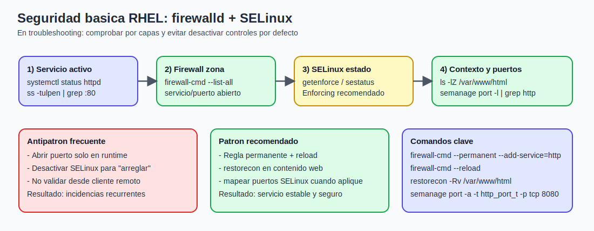

# Tema 2: Seguridad basica con firewalld y nociones de SELinux

## Objetivo

Aplicar una capa minima de seguridad operativa en RHEL/Rocky: exponer solo lo necesario en red y entender bloqueos basicos de SELinux.

## Resumen para pizarra

1. `firewalld` define que entra/sale por zonas; SELinux define que puede hacer cada proceso.
1. Abrir puerto no garantiza servicio: tambien hay que validar contexto SELinux.
1. En firewall: diferencia entre runtime y permanente (`--permanent` + `--reload`).
1. En SELinux: revisar estado, contextos, puertos y AVC antes de tocar politicas.
1. Nunca desactivar SELinux como primera medida de troubleshooting.



### Capturas oficiales de Red Hat (referencia visual)

Gestion de firewall por zonas en Cockpit:


Alta de un servicio en firewall desde la consola web:


Si no se visualizan en tu IDE, abre aqui:  
[Cockpit firewall (Red Hat)](https://access.redhat.com/webassets/avalon/d/Red_Hat_Enterprise_Linux-7-Managing_systems_using_the_RHEL_7_web_console-en-US/images/e1f5717db0598f4b55db66700ec36942/cockpit-fw.png)  
[Cockpit add firewall service (Red Hat)](https://access.redhat.com/webassets/avalon/d/Red_Hat_Enterprise_Linux-7-Managing_systems_using_the_RHEL_7_web_console-en-US/images/2ba0e8f95c7f26f625921ba2678b2f4e/cockpit-add-service.png)

Fuente: [Red Hat Documentation - Configuring firewall in the web console](https://docs.redhat.com/en/documentation/red_hat_enterprise_linux/7/html/managing_systems_using_the_rhel_7_web_console/configuring-firewall-in-the-web-console)

## Parte A - firewalld (base practica)

`firewalld` gestiona reglas de firewall por zonas y permite cambios en runtime y permanentes.

En RHEL moderno, `firewalld` actua como capa de gestion sobre `nftables` (en sistemas recientes) o `iptables` (entornos antiguos).  
Para el alumno, el punto clave es: trabajar con `firewall-cmd` evita tocar reglas low-level a mano y reduce errores operativos.

Conceptos clave:

1. Zona: conjunto de reglas asociado a confianza de red (`public`, `internal`, etc.).
1. Servicio: alias de puertos/protocolos comunes (`http`, `ssh`, `https`).
1. Puerto: apertura explicita (`8080/tcp`).
1. Runtime vs permanente:
1. runtime: cambia ahora, se pierde en reinicio
1. permanente: persiste, requiere `--reload` para aplicar

### Zonas y modelo de confianza

Una zona representa nivel de confianza del origen de red:

1. `public`: red no confiable, minima apertura.
1. `internal`: red interna, reglas mas permisivas.
1. `trusted`: todo permitido (evitar salvo necesidad clara).
1. `drop` / `block`: denegacion fuerte.

En troubleshooting es comun tener reglas correctas en la zona equivocada.  
Siempre valida zona activa e interfaces asociadas antes de abrir puertos.

### Comandos base

```bash
# Estado del servicio firewall
systemctl status firewalld

# Ver zona activa e interfaces asociadas
firewall-cmd --get-active-zones

# Ver reglas de la zona por defecto
firewall-cmd --list-all

# Abrir servicio HTTP (runtime + permanente)
firewall-cmd --add-service=http
firewall-cmd --permanent --add-service=http
firewall-cmd --reload

# Abrir puerto custom
firewall-cmd --permanent --add-port=8080/tcp
firewall-cmd --reload
```

### Verificacion operativa recomendada

```bash
# Zona por defecto y activas
firewall-cmd --get-default-zone
firewall-cmd --get-active-zones

# Reglas completas de una zona concreta
firewall-cmd --zone=public --list-all

# Listado explicito de servicios y puertos permitidos
firewall-cmd --zone=public --list-services
firewall-cmd --zone=public --list-ports
```

### Reglas avanzadas basicas (rich rules)

Cuando necesites mayor control (origen, logging, deny selectivo), usa rich rules:

```bash
firewall-cmd --permanent --add-rich-rule='rule family="ipv4" source address="192.168.56.0/24" service name="http" accept'
firewall-cmd --reload
```

Esto permite abrir un servicio solo para una subred concreta.

### Buenas practicas

1. Preferir `--add-service` antes que abrir puertos sueltos.
1. Mantener solo puertos necesarios.
1. Documentar cualquier apertura temporal.
1. Verificar desde cliente (no solo desde localhost).
1. Aplicar principio de minimo privilegio por zona y origen.
1. Auditar periodicamente reglas antiguas o huerfanas.

## Parte B - SELinux (modo basico)

SELinux aplica control de acceso obligatorio (MAC).  
Aunque el usuario tenga permisos Unix correctos, una politica SELinux puede bloquear la accion.

Diferencia importante:

1. permisos Unix (DAC): control por propietario/grupo/otros;
1. SELinux (MAC): control adicional por contexto y politica.

Por eso un `chmod 777` no corrige necesariamente un bloqueo SELinux.

Estados:

1. `Enforcing`: aplica y bloquea segun politica.
1. `Permissive`: no bloquea, pero registra alertas.
1. `Disabled`: sin SELinux (no recomendado para produccion).

## Conceptos minimos de contexto SELinux

Cada proceso y archivo tiene un contexto.  
Para web, es comun ver tipos como:

1. `httpd_t`: dominio del proceso Apache.
1. `httpd_sys_content_t`: contenido web de solo lectura permitido.
1. `http_port_t`: puertos permitidos para servicios web.

Si proceso y recurso no encajan en la politica, SELinux genera denegacion.

### Comandos minimos de diagnostico

```bash
getenforce
sestatus
ls -Z /var/www/html
ps -eZ | head
ausearch -m avc -ts recent
```

### Caso clasico en web

Situacion: el servicio web arranca, firewall esta abierto, pero el contenido no se sirve.

Posibles causas SELinux:

1. Contexto incorrecto en archivos web.
1. Puerto no asociado al tipo permitido para `httpd`.

Comprobaciones base:

```bash
# Ver contextos del contenido web
ls -lZ /var/www/html

# Ver puertos permitidos para httpd
semanage port -l | grep http_port_t
```

Analisis adicional recomendado:

```bash
# Mensajes recientes de denegacion
journalctl -t setroubleshoot --since "30 min ago"

# Sugerencias de solucion basadas en AVC (si esta instalado)
sealert -a /var/log/audit/audit.log
```

Correcciones tipicas:

```bash
# Restaurar contexto por defecto del contenido web
restorecon -Rv /var/www/html

# Si usas puerto alternativo (ejemplo 8080), mapearlo a http_port_t
semanage port -a -t http_port_t -p tcp 8080
```

Si el puerto ya existe con otro tipo, usar modificacion:

```bash
semanage port -m -t http_port_t -p tcp 8080
```

## Booleans SELinux utiles (nivel inicial)

Los booleans activan comportamientos permitidos por politica sin reescribir reglas:

```bash
getsebool -a | grep httpd
```

Ejemplo frecuente:

```bash
setsebool -P httpd_can_network_connect on
```

Uso tipico: cuando `httpd` necesita salir a red (proxy, backend API, DB remota).

## Enfoque de troubleshooting seguro

1. No desactivar SELinux como primera accion.
1. Validar primero servicio, firewall y contexto.
1. Solo usar `setenforce 0` como prueba puntual y temporal.
1. Si con SELinux permisivo funciona, investigar politica/contexto y revertir a `Enforcing`.

Secuencia recomendada:

1. validar proceso (`systemctl`, puertos de escucha);
1. validar firewall (zona, servicio/puerto);
1. validar SELinux (contexto, puertos, AVC);
1. solo si hace falta, prueba temporal en `Permissive`;
1. aplicar correccion permanente y volver a `Enforcing`.

## Errores frecuentes

1. Abrir puerto en runtime y olvidar la regla permanente.
1. Confundir zona activa y abrir en otra zona.
1. Resolver bloqueos quitando SELinux permanentemente.
1. No validar acceso real desde otra maquina.
1. Corregir permisos Unix cuando el problema real es contexto SELinux.
1. Mezclar cambios de firewall y SELinux sin registrar evidencias.
