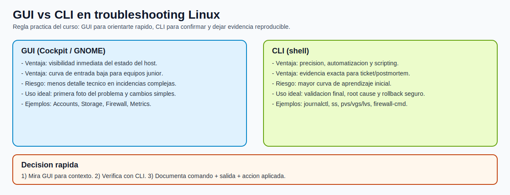
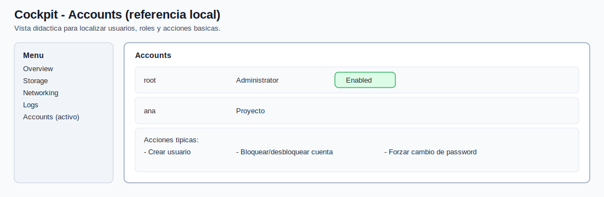
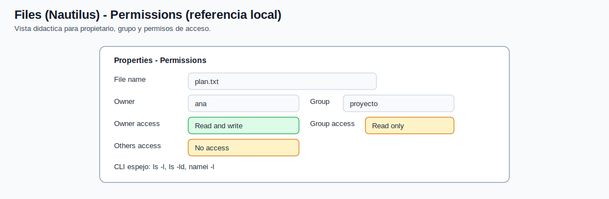
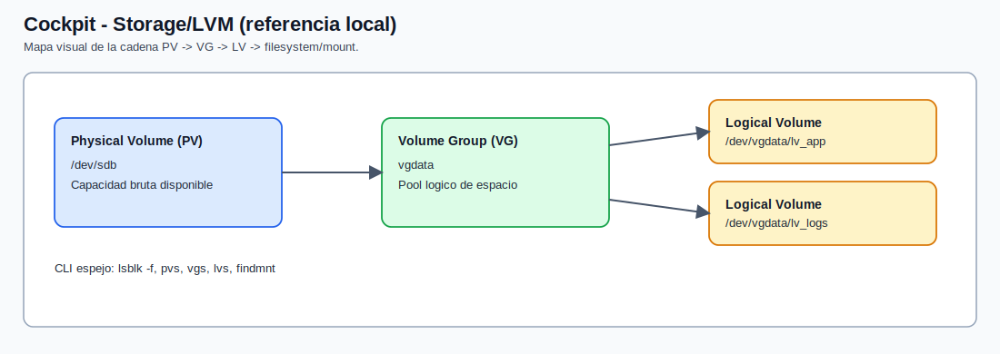
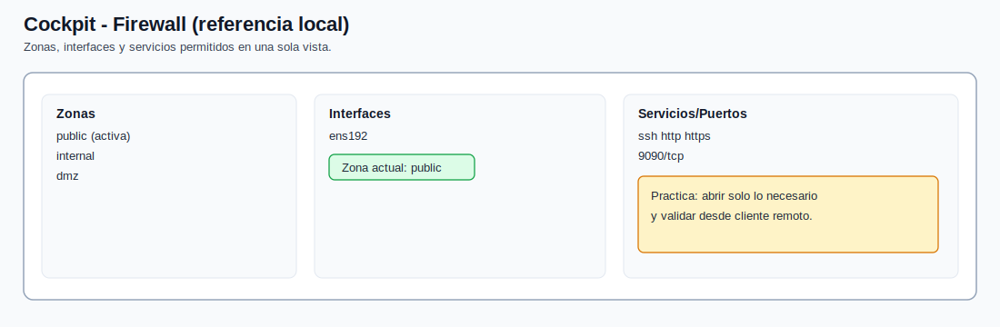
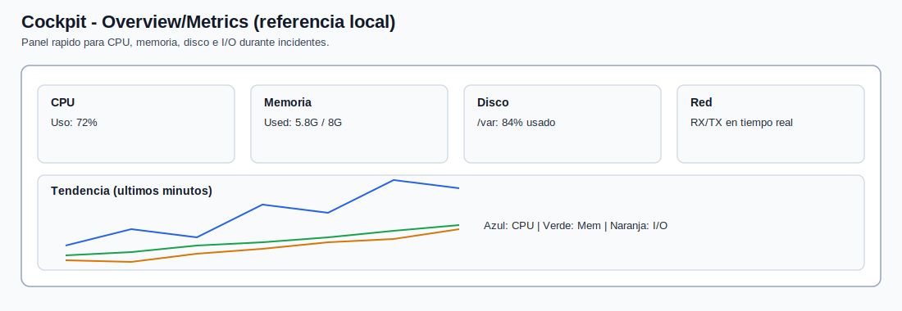

# Tema 0: Herramienta GUI (simil visual de los temas del curso)

## Objetivo

Ubicar en interfaz grafica los componentes clave del troubleshooting para que el alumno pueda traducir GUI <-> CLI sin perder el metodo tecnico.

## Idea base (teoria breve)

En entornos Linux de administracion, la GUI ayuda a:

1. visualizar estado de forma rapida;
1. reducir curva de aprendizaje inicial;
1. validar cambios de forma intuitiva.

Pero la CLI sigue siendo critica para:

1. automatizacion;
1. evidencia repetible;
1. diagnostico fino en incidencias reales.

Regla del curso: usar GUI para orientarte y CLI para confirmar.



## Herramienta recomendada

`Cockpit` (web console) como consola central de administracion.

## Cockpit: origen, que es y hacia donde va

### Origen y contexto

`Cockpit` nace en el ecosistema Linux como una consola web de administracion de servidores, con fuerte adopcion en distribuciones empresariales como RHEL y derivadas.

Idea clave de origen:

1. reducir tareas manuales repetitivas de administracion;
1. ofrecer una vista central de estado del host;
1. mantener compatibilidad con herramientas nativas de Linux (`systemd`, `NetworkManager`, `firewalld`, LVM).

### Que es tecnicamente

`Cockpit` no sustituye Linux ni "oculta magia": es una capa de gestion web sobre componentes del sistema.

En practica:

1. usa autenticacion del propio sistema;
1. muestra datos reales del host (servicios, red, almacenamiento, logs);
1. ejecuta acciones administrativas equivalentes a comandos CLI;
1. permite operar de forma remota por navegador.

### Por que encaja en troubleshooting

1. acelera la observacion inicial del problema;
1. ayuda a correlacionar estado de varias capas en una sola vista;
1. reduce errores de navegacion para perfiles junior.

Punto importante del curso:

1. GUI para orientacion y velocidad;
1. CLI para validacion tecnica, automatizacion y evidencia reproducible.

### Futuro (vision operativa)

La tendencia de `Cockpit` es seguir como interfaz ligera para operacion diaria de servidores Linux, integrada con el stack estandar del sistema.

En terminos practicos para el alumno:

1. aprender Cockpit aporta productividad inmediata en tareas recurrentes;
1. dominar CLI sigue siendo obligatorio para incidencias complejas y scripting;
1. el enfoque mas robusto es combinar ambos, no elegir solo uno.

Instalacion y activacion:

```bash
dnf install -y cockpit
systemctl enable --now cockpit.socket
systemctl status cockpit.socket
```

Acceso habitual: `https://<IP_DE_LA_VM>:9090`

Alternativa en entorno de escritorio: `gnome-control-center`.

## Mapa GUI por tema

### 1) Usuarios y grupos

GUI:

1. Cockpit -> `Accounts`.
1. GNOME -> `Settings -> Users`.



CLI equivalente:

```bash
id <usuario>
getent passwd <usuario>
getent group <grupo>
```

### 2) Permisos de archivos

GUI:

1. Files (Nautilus) -> clic derecho -> `Properties -> Permissions`.
1. Revisar propietario, grupo y permisos del recurso.



CLI equivalente:

```bash
ls -l <archivo>
ls -ld <directorio>
namei -l <ruta>
```

### 3) Storage y LVM

GUI:

1. Cockpit -> `Storage` (discos, particiones, volumenes, filesystems y montaje).
1. Identificar relacion PV -> VG -> LV y punto de montaje.



CLI equivalente:

```bash
lsblk -f
pvs
vgs
lvs
findmnt
```

### 4) Firewall y seguridad

GUI:

1. Cockpit -> `Networking -> Firewall` (zonas, servicios, puertos).
1. Si existe plugin/panel, revisar estado de SELinux.



CLI equivalente:

```bash
firewall-cmd --get-active-zones
firewall-cmd --list-all
getenforce
sestatus
```

### 5) Tools de rendimiento

GUI:

1. Cockpit -> `Overview` / `Metrics` (CPU, memoria, disco, red).



CLI equivalente:

```bash
top
free -h
df -hT
iostat -xz 1 3
```

## Evidencia minima del alumno

1. Ruta GUI localizada para cada uno de los 5 temas.
1. Comando CLI equivalente ejecutado para validar el mismo punto tecnico.
