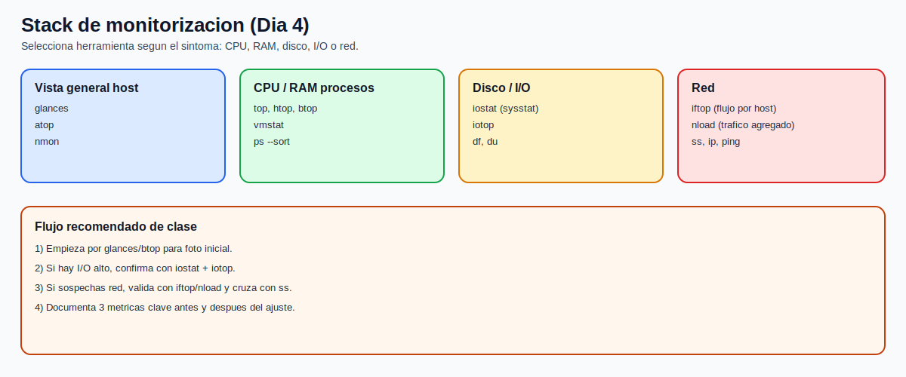
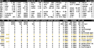
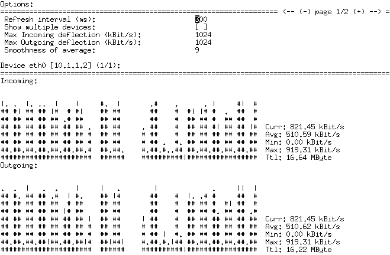
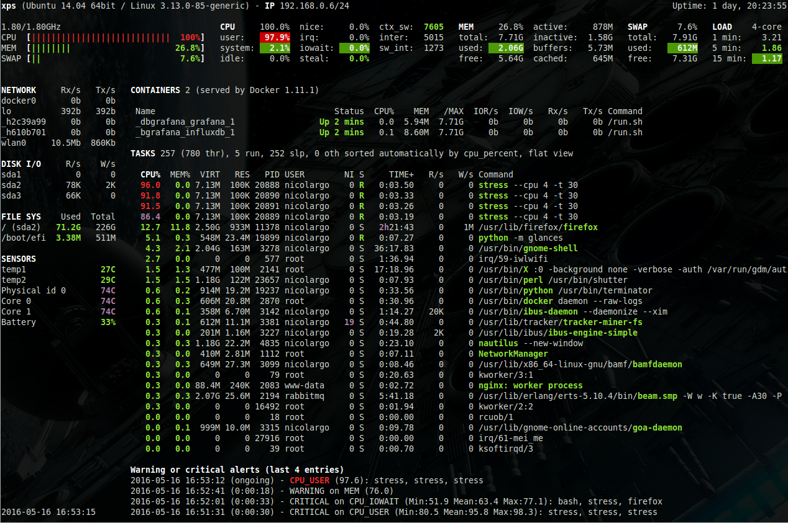
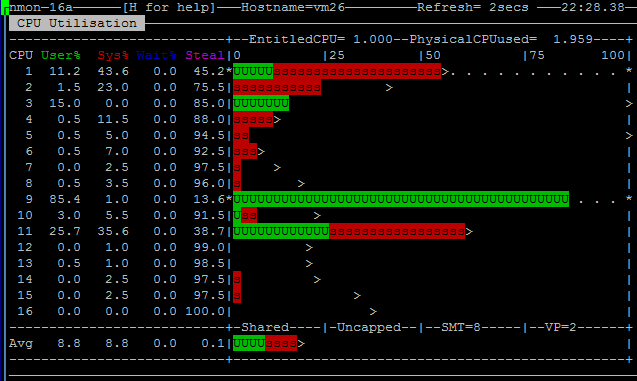

# Tema 1: Monitorizacion basica (CPU, RAM, disco e I/O)

## Objetivo

Construir una base operativa para detectar saturacion o degradacion de rendimiento usando comandos simples y disponibles en casi cualquier sistema RHEL/Rocky.

## Resumen para pizarra

1. No hay troubleshooting serio sin linea base de consumo.
1. CPU alta no siempre es problema: importa si afecta latencia y cola de trabajo.
1. Memoria baja no es igual a incidente: revisar `available` y swap.
1. Disco lleno y I/O lento son causas frecuentes de caidas de servicios.
1. Validar en serie: CPU -> RAM -> filesystem -> I/O.

## Stack de herramientas del laboratorio

Ademas de comandos base, en este dia usamos un set de herramientas TUI para observabilidad rapida:

```bash
sudo dnf install -y \
  glances \
  btop \
  htop \
  sysstat \
  iotop \
  nload \
  iftop \
  atop \
  nmon
```

Uso recomendado por tipo de sintoma:

1. Vista general host: `glances`, `atop`, `nmon`.
1. CPU/RAM/procesos: `btop`, `htop`, `top`.
1. Disco/I/O: `iostat` (de `sysstat`) + `iotop`.
1. Trafico/red: `nload` (agregado) + `iftop` (conversaciones por host).



## 1) CPU: carga y procesos activos

Comandos base:

```bash
uptime
top
ps -eo pid,ppid,cmd,%cpu,%mem --sort=-%cpu | head
```

Que mirar:

1. `load average` de `uptime` en ventanas 1/5/15 min.
1. `%Cpu(s)` en `top`: `us`, `sy`, `wa`, `id`.
1. Procesos que concentran CPU por tiempo sostenido.

Reglas practicas:

1. `wa` alta indica espera de I/O, no saturacion pura de CPU.
1. Carga puntual alta no implica incidente si no afecta servicio.
1. Carga sostenida + latencia de aplicacion si requiere accion.

Herramientas sugeridas en este bloque:

```bash
btop
htop
top
```


Fuente: [btop (GitHub oficial)](https://github.com/aristocratos/btop)

## 2) RAM y swap: presion de memoria

Comandos base:

```bash
free -h
cat /proc/meminfo | head -n 20
vmstat 1 5
```

Que mirar:

1. `available` en `free -h` (mas util que `free` aislado).
1. Uso de swap (`si/so` en `vmstat` para entradas/salidas).
1. Crecimiento anomalo de procesos en memoria.

Reglas practicas:

1. Linux usa cache: memoria "used" alta puede ser normal.
1. Swap activa no siempre es mala; `si/so` sostenido si indica presion real.
1. Revisar proceso top memoria antes de reiniciar servicios.

## 3) Espacio en disco: capacidad y riesgo operativo

Comandos base:

```bash
df -hT
df -i
du -xh /var | sort -h | tail -n 20
find /var/log -type f -size +100M -ls | head
```

Que mirar:

1. Particiones por encima de 80-90%.
1. Inodos (`df -i`) agotados aunque queden GB libres.
1. Directorios y ficheros que crecen fuera de patron.

Reglas practicas:

1. Llenado en `/var` suele romper logs, colas y servicios.
1. Sin inodos no se pueden crear ficheros aunque haya espacio.
1. Limpiar con criterio: primero evidencia, luego accion.

## 4) I/O de disco: latencia y throughput

Instalacion (si no esta):

```bash
dnf install -y sysstat
```

Comandos base:

```bash
iostat -xz 1 5
```


Fuente: [sysstat / iostat (GitHub oficial)](https://github.com/sysstat/sysstat)

Que mirar:

1. `%util` cercano a 100% de forma sostenida.
1. `await` alto (latencia de espera en I/O).
1. Relacion lectura/escritura segun tipo de carga esperada.

Reglas practicas:

1. `await` alto + `wa` alto suele explicar lentitud general.
1. CPU aparentemente libre con I/O saturado es un patron clasico.
1. Correlacionar siempre con proceso responsable (`pidstat`, `iotop` si disponible).

Comandos complementarios:

```bash
iotop
atop
```


Fuente: [iotop (GitHub oficial)](https://github.com/Tomas-M/iotop)


Fuente: [atop (sitio oficial)](https://www.atoptool.nl/screenshots.php)

## 5) Red en tiempo real: throughput y flujos

Comandos utiles:

```bash
nload
iftop
```

Que mirar:

1. Picos de trafico no esperados.
1. Conversaciones que saturan enlace.
1. Correlacion entre red alta y latencia de aplicacion.


Fuente: [iftop (sitio oficial)](https://www.ex-parrot.com/pdw/iftop/)


Fuente: [nload (sitio/proyecto oficial)](http://www.roland-riegel.de/nload/)

## 6) Vista todo-en-uno para triage inicial

Cuando necesitas una foto global en menos de 1 minuto:

```bash
glances
```


Fuente: [Glances (documentacion oficial)](https://glances.readthedocs.io/en/latest/quickstart.html)

## 7) Otras herramientas del stack (capturas oficiales)

`htop`:


Fuente: [htop (sitio oficial)](https://htop.dev/screenshots.html)

`nmon`:


Fuente: [nmon (SourceForge oficial)](https://sourceforge.net/projects/nmon/)

## Flujo minimo recomendado (5 minutos)

```bash
uptime
top -b -n 1 | head -n 20
free -h
df -hT
df -i
iostat -xz 1 3
```

Con esta foto inicial puedes decidir si el problema parece:

1. saturacion de CPU;
1. presion de memoria;
1. falta de capacidad;
1. cuello de botella de disco.

## Errores frecuentes

1. Actuar sin baseline previa.
1. Confundir memoria en cache con fuga.
1. Limpiar logs sin revisar causa de crecimiento.
1. Ignorar inodos y revisar solo GB.
1. Mirar solo una metrica y no correlacionar.
