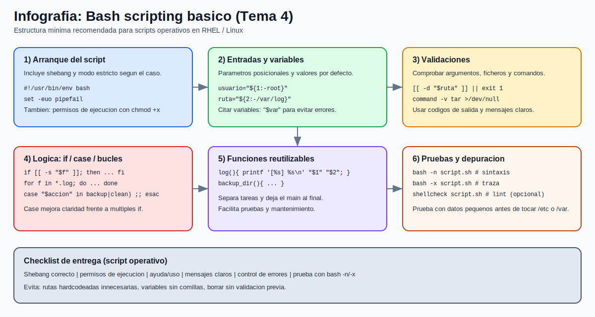

# Tema 4: Shell script (Bash) basico para automatizacion

## Objetivo

Entender las nociones basicas para crear scripts en Bash que automaticen tareas operativas repetitivas (copias, validaciones, logs, chequeos y mantenimiento simple).

## Cuando usar un script Bash

Casos tipicos en administracion Linux/RHEL:

1. Ejecutar una secuencia de comandos siempre igual.
1. Validar estado del sistema y generar un reporte rapido.
1. Hacer backups simples de configuraciones o logs.
1. Estandarizar tareas de soporte para reducir errores manuales.

Regla practica:

1. Si repites la misma tarea mas de 2-3 veces, conviene convertirla en script.

## Infografia rapida (propia): anatomia de un script Bash



## Recursos visuales y documentacion oficial Red Hat

### Imagen/cheat sheet de Red Hat Developer (referencia visual)


Fuente oficial: [Bash Commands Cheat Sheet (Red Hat Developer)](https://developers.redhat.com/cheat-sheets/bash-shell-cheat-sheet)

### Red Hat Blog (introduccion a scripting)

En algunos visores Markdown de IDE, las imagenes del blog de Red Hat no cargan bien por URLs dinamicas/hotlink.  
Usa el enlace oficial (contenido recomendado):

Fuente oficial: [Bash shell scripting for beginners (Red Hat Blog)](https://www.redhat.com/en/blog/bash-shell-scripting)

### Documentacion y lecturas recomendadas (Red Hat)

1. [Bash Commands Cheat Sheet (Red Hat Developer)](https://developers.redhat.com/cheat-sheets/bash-shell-cheat-sheet) -> sintaxis y comandos frecuentes.
1. [Bash shell scripting for beginners (Red Hat Blog)](https://www.redhat.com/en/blog/bash-shell-scripting) -> introduccion guiada paso a paso.
1. [How to write a Bash script (Red Hat Blog)](https://www.redhat.com/en/blog/learn-bash-scripting) -> conceptos y ejemplo practico.
1. [RHEL cheat sheets (Customer Portal)](https://access.redhat.com/rhel-cheatsheets) -> indice de hojas de referencia oficiales.

## 1) Estructura minima de un script

Todo script Bash necesita una forma clara de arranque y ejecucion. La estructura minima define el interprete y el primer flujo de instrucciones que ejecutara el sistema.

Archivo: `mi_script.sh`

```bash
#!/usr/bin/env bash

echo "Hola desde Bash"
```

Puntos clave:

1. `#!/usr/bin/env bash` (shebang) indica con que interprete ejecutar.
1. Guarda el archivo con extension `.sh` (recomendado por claridad).
1. Da permisos de ejecucion:

```bash
chmod +x mi_script.sh
./mi_script.sh
```

Tambien puedes ejecutarlo sin `chmod`:

```bash
bash mi_script.sh
```

## 2) Variables y comillas (muy importante)

Las variables permiten reutilizar valores y hacer scripts flexibles. El uso correcto de comillas evita errores por espacios, caracteres especiales o valores vacios.

```bash
#!/usr/bin/env bash

usuario="admin"
ruta="/var/log"
echo "Usuario: $usuario"
echo "Ruta: $ruta"
```

Buenas practicas:

1. Usa comillas dobles en variables: `"$ruta"`.
1. Evita espacios alrededor de `=` en asignaciones.
1. Usa nombres claros (`backup_dir`, `fecha_actual`).

Ejemplo con valor por defecto:

```bash
destino="${1:-/tmp}"
echo "Destino: $destino"
```

## 3) Parametros de entrada

Los parametros convierten un script en una herramienta reutilizable. En lugar de editar el codigo cada vez, se pasan datos desde la linea de comandos.

En Bash, los parametros posicionales permiten leer los argumentos en el orden en que se escriben. Tambien existen variables especiales para saber el nombre del script y cuantos argumentos se recibieron.

```bash
#!/usr/bin/env bash

echo "Script: $0"
echo "Arg1 : $1"
echo "Arg2 : $2"
echo "Total: $#"
```

Que significa cada uno en este ejemplo:

1. `$0` -> nombre (o ruta) con el que se ejecuto el script.
1. `$1` -> primer argumento recibido.
1. `$2` -> segundo argumento recibido.
1. `$#` -> cantidad total de argumentos recibidos (sin contar `$0`).

Uso:

```bash
./params.sh /var/log 10
```

## 4) Condicionales (`if`) y comparaciones

Los condicionales permiten tomar decisiones en funcion del estado del sistema o de la entrada recibida. Son la base para automatizar comprobaciones y respuestas.

```bash
#!/usr/bin/env bash

archivo="${1:-/etc/hosts}"

if [[ -f "$archivo" ]]; then
  echo "Existe: $archivo"
else
  echo "No existe: $archivo"
fi
```

Comparaciones frecuentes:

1. `[[ -f archivo ]]` -> archivo regular existe.
1. `[[ -d dir ]]` -> directorio existe.
1. `[[ -z "$var" ]]` -> variable vacia.
1. `[[ "$a" == "$b" ]]` -> igualdad de cadenas.
1. `[[ "$n" -gt 10 ]]` -> comparacion numerica.

## 5) Bucles (`for`, `while`) y `case`

Estas estructuras controlan el flujo cuando necesitas repetir tareas o elegir acciones segun una opcion. Mejoran la escalabilidad del script y reducen codigo repetido.

### `for` para recorrer ficheros

```bash
for f in /var/log/*.log; do
  [[ -e "$f" ]] || continue
  echo "Procesando: $f"
done
```

### `while` para leer linea a linea

```bash
while IFS= read -r linea; do
  echo ">> $linea"
done < /etc/hosts
```

### `case` para acciones

```bash
accion="${1:-help}"

case "$accion" in
  check)
    echo "Comprobando sistema"
    ;;
  backup)
    echo "Ejecutando backup"
    ;;
  *)
    echo "Uso: $0 {check|backup}"
    exit 1
    ;;
esac
```

## 6) Funciones y reutilizacion

Las funciones agrupan logica en bloques reutilizables con nombre. Esto facilita mantener scripts mas largos y separar tareas operativas de forma ordenada.

```bash
log_info() {
  echo "[INFO] $1"
}

log_error() {
  echo "[ERROR] $1" >&2
}
```

Ventajas:

1. Reutilizas bloques sin repetir codigo.
1. Mejoras legibilidad.
1. Facilitas mantenimiento y pruebas.

## 7) Codigos de salida y control de errores

Un script no solo debe mostrar mensajes, tambien debe devolver un estado interpretable por otros scripts o herramientas. Los codigos de salida son clave en automatizacion y monitorizacion.

En Linux, `0` suele significar exito y distinto de `0`, error.

```bash
#!/usr/bin/env bash

if systemctl is-active --quiet sshd; then
  echo "sshd activo"
  exit 0
else
  echo "sshd no activo"
  exit 1
fi
```

Modo estricto (util en scripts operativos):

```bash
set -euo pipefail
```

Resumen:

1. `-e` -> aborta si falla un comando (con matices).
1. `-u` -> error si usas variable no definida.
1. `pipefail` -> detecta fallos dentro de pipelines.

## 8) Depuracion basica

Antes de ejecutar un script en un entorno real, conviene validar sintaxis y observar su comportamiento paso a paso. Esto reduce fallos y acelera el diagnostico.

Chequeo de sintaxis:

```bash
bash -n mi_script.sh
```

Ejecucion con traza:

```bash
bash -x mi_script.sh
```

Consejo practico:

1. Prueba primero con rutas de laboratorio (`/tmp`) antes de tocar `/etc`, `/var` o backups reales.

## 9) Ejemplo completo: backup simple de logs

Este ejemplo integra varias piezas vistas antes: parametros, validaciones, variables y control de errores. Sirve como plantilla para automatizaciones basicas de administracion.

```bash
#!/usr/bin/env bash
set -euo pipefail

origen="${1:-/var/log}"
destino="${2:-/tmp/backups}"
fecha="$(date +%F_%H%M%S)"
salida="$destino/logs_$fecha.tar.gz"

mkdir -p "$destino"

if [[ ! -d "$origen" ]]; then
  echo "ERROR: no existe el directorio $origen" >&2
  exit 1
fi

tar -czf "$salida" "$origen"
echo "Backup creado: $salida"
```

Ejecucion:

```bash
chmod +x backup_logs.sh
./backup_logs.sh /var/log /tmp/backups
```

## Checklist de calidad (script basico)

1. Tiene shebang correcto.
1. Usa variables con comillas.
1. Valida parametros de entrada.
1. Maneja errores con codigos de salida.
1. Incluye mensajes claros para el operador.
1. Se ha probado con `bash -n` y `bash -x`.

## Errores frecuentes

1. Ejecutar scripts sin validar rutas ni argumentos.
1. Usar variables sin comillas (`$var` en vez de `"$var"`).
1. Borrar/mover archivos sin una comprobacion previa.
1. Mezclar demasiada logica en una sola linea.
1. No probar en un entorno seguro antes de produccion.

## Mini-lab sugerido (10-15 min)

Crear `check_disk.sh` que:

1. Reciba una ruta (por defecto `/`).
1. Muestre `df -h` de esa ruta.
1. Avise con mensaje `WARNING` si uso > 80%.
1. Devuelva `exit 0` si OK y `exit 1` si supera el umbral.
